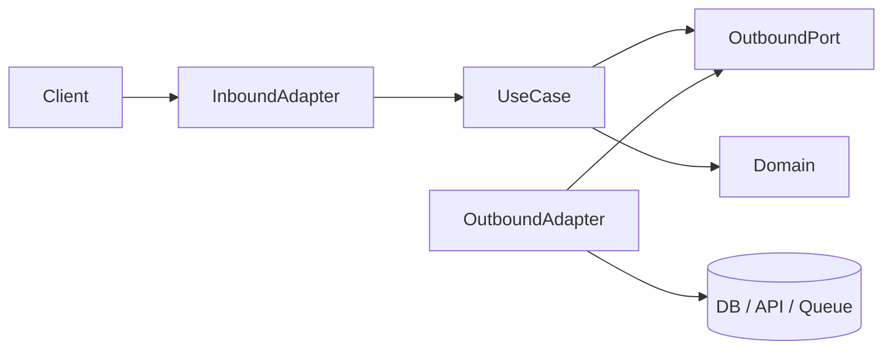

# Hexagonal (ports and adapters)

Business rules sit at the center; frameworks and I/O sit at the edge. Dependencies point inward.

## Layers

| Layer | Contains |
|-------|----------|
| Domain | Entities, value objects, pure policies — no HTTP/ORM imports |
| Application | Use cases, inbound/outbound port interfaces, DTOs |
| Adapters | HTTP controllers, ORM repos, message consumers, SDK wrappers |
| Composition | Wire concrete adapters to use cases once |

## Workflow

1. Define use case input/output DTOs (no `Request` types inside).
2. List outbound ports (`OrderRepositoryPort`, `PaymentPort`, `ClockPort`).
3. Implement use case orchestration injecting ports.
4. Inbound adapter maps HTTP/job payload → DTO → use case → HTTP response.
5. Outbound adapter implements port with SQL/SDK calls.

```ts
export interface OrderStore {
  save(order: Order): Promise<void>;
  find(id: string): Promise<Order | null>;
}

export class PlaceOrder {
  constructor(private store: OrderStore, private pay: PaymentPort) {}
  async run(cmd: PlaceOrderCmd): Promise<PlaceOrderResult> {
    const order = Order.create(cmd);
    const auth = await this.pay.authorize({ amount: order.totalCents, id: order.id });
    await this.store.save(order.markPaid(auth.id));
    return { orderId: order.id };
  }
}
```

## Layout (feature-first)

```
src/features/billing/
  domain/
  application/ports/ + use-cases/
  adapters/inbound/http/ + outbound/postgres/
  composition/registerBilling.ts
```

## Testing

- Domain: pure unit tests.
- Use case: fakes for ports.
- Adapter: contract tests per port; integration with real DB/API.
- E2E: inbound adapter through stack.

## Migration

Strangler: one vertical slice at a time; facade legacy behind ports; characterization tests before moves; centralize wiring early. Avoid big-bang rewrites.

## Anti-patterns

ORM entities in domain; use cases reading `req.query`; adapter-to-adapter calls bypassing use cases; hidden global singletons for dependencies.

## Multi-language

Same boundaries in Java/Kotlin (`application.port.in/out`), Go (small interfaces in application package, wire in `cmd/`), etc. Framework annotations stay in adapters only.

## Flow



## Language packaging

| Runtime | Port location | Wiring |
|---------|---------------|--------|
| TypeScript | `application/ports` | factory module / Nest `Module` providers |
| Java | `application.port.in/out` | Spring `@Configuration` or manual |
| Kotlin | same as Java | Koin/Dagger/Spring modules |
| Go | interfaces beside use case | `main` or `wire/` package |

Inbound adapter responsibilities: protocol validation, auth extraction, map to command DTO, map domain errors to HTTP/status. Outbound: translate port calls to SQL/SDK, map infra errors to domain errors (no leaking driver types upward).

## Refactor sequence (repeat per slice)

Extract command + result types → introduce ports around existing DB calls → move orchestration from fat controller/service into use case → make legacy controller call use case → unit test use case with fakes → integration test one adapter → delete dead paths when parity proven.
